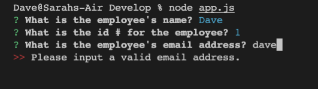
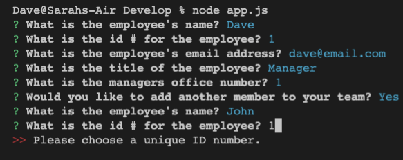
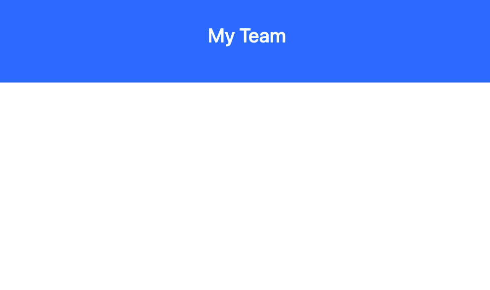
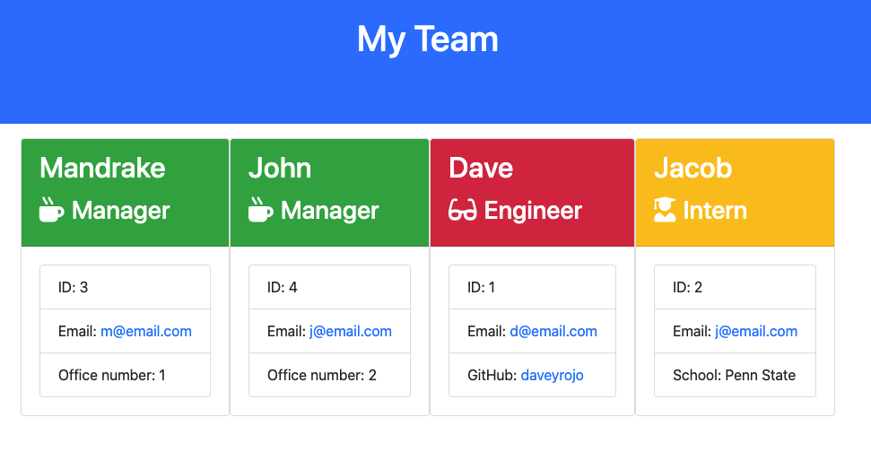

# Team Builder

## Achieved:
    - can create engineer, intern or manager class
    - code is very dry
        - questions for all classes are written in one path
        - code only diverges when needed
        - prevents redundancies
    - relative colorization for more attractive UX

## Links
[Video](https://drive.google.com/file/d/1WyRNWrLVLl07xLbu4sia7HLYsSj3Lvt1/view)

[GitHub Repo](https://github.com/daveyrojo/team-builder)

## Screen Shots
Invalid Email:

Unique ID Error:

Start Screen:

Screen With Team:
